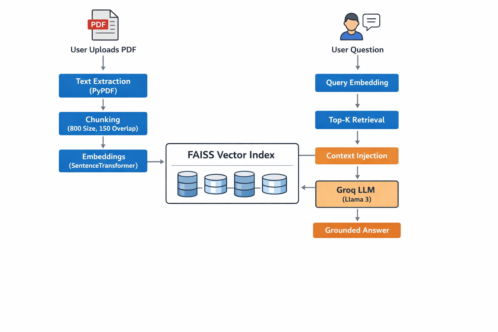
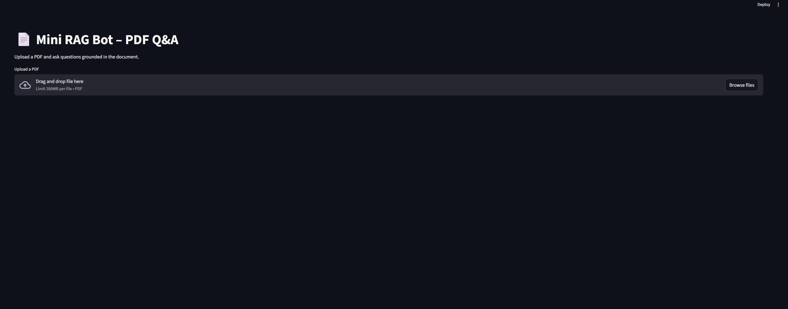
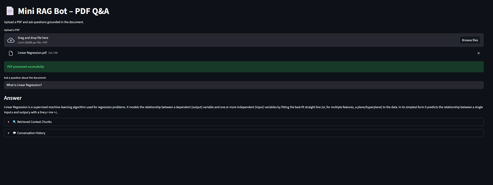
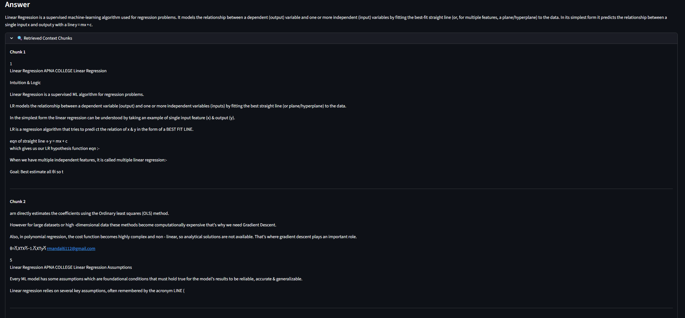

# Assignment 2: Mini RAG Bot – PDF Q&A

## 📌 Task

Build a simple Q&A chatbot over one PDF using a Retrieval-Augmented Generation (RAG) approach.

### Evaluation Criteria

- Chunking strategy
- Embedding approach
- Retrieval quality
- Answer reliability

---

# 🚀 Overview

This project implements a lightweight Retrieval-Augmented Generation (RAG) pipeline that allows users to upload a PDF document and ask questions grounded strictly in the document content.

The system performs:

1. PDF text extraction
2. Text chunking with overlap
3. Dense embedding generation
4. FAISS vector indexing
5. Top-K semantic retrieval
6. Grounded answer generation using Groq (Llama 3)

The implementation avoids orchestration frameworks (e.g., LangChain) to clearly demonstrate understanding of core RAG components.

---

# 🏗️ System Architecture

  

---

# 1️⃣ Chunking Strategy

### Method Used

- Character-based chunking
- Chunk size: ~800 characters
- Overlap: 150 characters

### Why Overlap?

Overlap preserves semantic continuity between adjacent chunks and prevents important information from being split across boundaries.

### Rationale

- Very small chunks → context fragmentation
- Very large chunks → noisy retrieval
- Overlap improves retrieval accuracy

This approach balances contextual integrity and computational efficiency.

---

# 2️⃣ Embedding Approach

### Model Used

`all-MiniLM-L6-v2` (SentenceTransformers)

### Why This Model?

- Lightweight and fast
- Strong semantic similarity performance
- Suitable for document-level retrieval
- Runs efficiently on CPU

### Embedding Process

- Each document chunk is converted into a dense vector.
- User queries are embedded using the same model.
- Similarity is computed between query and document embeddings.

---

# 3️⃣ Retrieval Quality

### Vector Store

FAISS (IndexFlatL2)

### Retrieval Strategy

- Top-K retrieval (K=3)
- Query embedding compared against stored chunk embeddings
- Most similar chunks selected as context

### Why Top-K?

- Limits noise from irrelevant chunks
- Provides sufficient context for answer generation
- Improves precision of grounded responses

The retrieved chunks are injected directly into the prompt to ensure answers are based on relevant document content.

---

# 4️⃣ Answer Reliability

To prevent hallucination, the LLM is explicitly instructed:

> "If the answer is not found in the provided context, say:  
> 'I cannot find this information in the document.'"

### Additional Controls

- Temperature set to 0 (deterministic responses)
- Context-only answering enforced in prompt
- Retrieved chunks optionally displayed for transparency

This ensures the system remains grounded in document content and avoids fabricated answers.

---

# 🔐 Secure API Handling

The Groq API key is stored securely in a `.env` file:

# 🖥️ Application Screenshots

## 📄 PDF Upload Interface

  

---

## ❓ Question Answering

  

---

## 🔍 Retrieved Context Chunks

  

